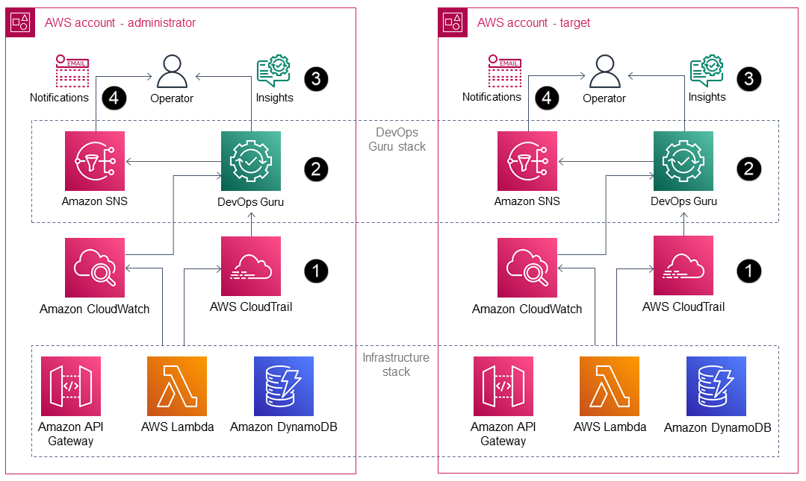

# Amazon DevOps Guru CDK Samples

[Amazon DevOps Guru](https://aws.amazon.com/devops-guru/) is a machine learning (ML) powered service that gives you a simpler way to improve an application’s availability and reduce expensive downtime. Without involving any complex configuration setup, DevOps Guru automatically ingests operational data in your AWS cloud. When DevOps Guru identifies a critical issue, it automatically alerts you with a summary of related anomalies, the likely root cause, and context on when and where the issue occurred. DevOps Guru also, when possible, provides prescriptive recommendations on how to remediate the issue.

## Target Architecture

## Configuring Amazon DevOps Guru

You need to configure Amazon DevOps Guru service and specify the coverage for which AWS resources to analyze. If your applications are distributed across multiple AWS accounts and AWS regions, you need to configure DevOps Guru for each account-region combination. Though this may sound complex, it is infact very simple to do so using AWS CDK Stacks and StackSet. You can also use CDK stack to enable DevOps Guru at Orgnization Units (OU) level instead of logging into each account and enabling one by one. 

Check out this APG Pattern for detailed deployment instructions: [Improve operational performance by enabling Amazon DevOps Guru across multiple AWS Regions, accounts, and OUs with the AWS CDK](https://docs.aws.amazon.com/prescriptive-guidance/latest/patterns/improve-operational-performance-by-enabling-amazon-devops-guru-across-multiple-aws-regions-accounts-and-ous-with-the-aws-cdk.html)  

## Useful CDK commands

 * `npm run build`   compile typescript to js
 * `npm run watch`   watch for changes and compile
 * `npm run test`    perform the jest unit tests
 * `cdk deploy`      deploy this stack to your default AWS account/region
 * `cdk diff`        compare deployed stack with current state
 * `cdk synth`       emits the synthesized CloudFormation template

## Security

See [CONTRIBUTING](CONTRIBUTING.md#security-issue-notifications) for more information.

## License

This library is licensed under the MIT-0 License. See the LICENSE file.
